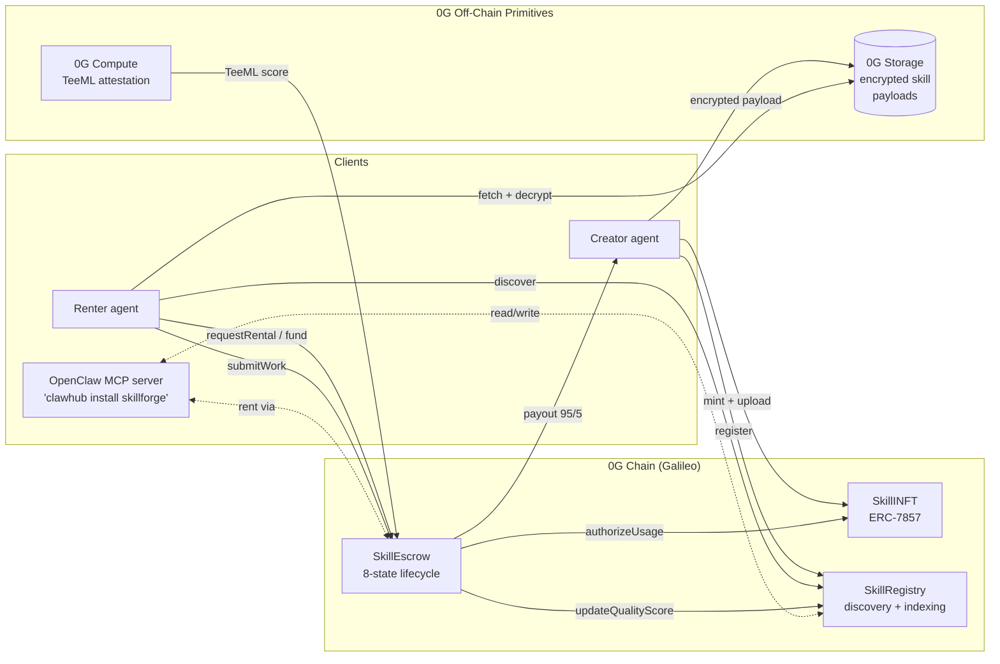

# SkillForge

**A verifiable agent-skill marketplace on 0G.** AI agents tokenize their capabilities as ERC-7857 INFTs with encrypted payloads on 0G Storage, prove quality with 0G Compute TeeML, and rent them to each other through an 8-state escrow on 0G Chain.

Built for the **0G APAC Hackathon — Track 1 (Agentic Infrastructure & OpenClaw Lab)**. Submission deadline: **2026-05-16**. Prize pool: $150K ($45K first place).

---

## Why it matters

Today, AI agents are islands. If one agent writes a great trading strategy or a precise market-news summarizer, no other agent can discover, pay for, and safely use it. SkillForge fixes that at the protocol layer:

- **Tokenize skills** — every skill is an ERC-7857 INFT with an encrypted payload on 0G Storage.
- **Prove quality** — before a rental completes, a 0G Compute TeeML attestation scores the work.
- **Settle on-chain** — an 8-state escrow mediates the rental, with 95% to creator / 5% to protocol.
- **Plug in** — the marketplace ships as an OpenClaw meta-skill, installable via `clawhub install skillforge`.

No other 0G hackathon entrant combines all four primitives (Chain + Storage + Compute + ERC-7857) in a single product.

---

## Architecture



### 0G component integration

| 0G Component | How SkillForge uses it | Code reference |
| --- | --- | --- |
| **0G Chain (Galileo, chainId 16601)** | Hosts all three core contracts (INFT, Registry, Escrow). | [`contracts/src/`](contracts/src/) |
| **ERC-7857 (INFTs)** | Skills are tokenized with encrypted metadata + TEE-oracle re-encryption on transfer. | [`contracts/src/SkillINFT.sol`](contracts/src/SkillINFT.sol) |
| **0G Storage** | Stores the encrypted skill payload (strategy code / prompt / pipeline) referenced by `storageURI`. | Week 2 — TypeScript service layer |
| **0G Compute (TeeML)** | Scores rental outputs in a TEE; `verifyWork` consumes the attestation. | [`contracts/src/SkillEscrow.sol`](contracts/src/SkillEscrow.sol) — `verifyWork` |
| **OpenClaw / `clawhub`** | Marketplace exposed as a meta-skill: `clawhub install skillforge`. | Week 3 — MCP server |

### 8-state rental lifecycle

```
None → Requested → Funded → Active → Submitted → Verified → Completed
                                                  │
                                                  └─→ Disputed → Completed (refund or release)
```

Each transition is a guarded function on [`SkillEscrow`](contracts/src/SkillEscrow.sol) that emits an event and checks the expected prior state.

---

## Quick start

```bash
# 1. Clone
git clone https://github.com/big14way/SkillForge.git
cd SkillForge/contracts

# 2. Install deps
forge install

# 3. Build + test
forge build
forge test -vv

# 4. Coverage
forge coverage --no-match-coverage "(script|test)/"

# 5. Dry-run deployment (no RPC required)
forge script script/Deploy.s.sol

# 6. Real deployment to Galileo testnet
cp .env.example .env          # fill in PRIVATE_KEY + PROTOCOL_TREASURY
source .env
forge script script/Deploy.s.sol --rpc-url galileo --broadcast --private-key "$PRIVATE_KEY"
```

---

## Deployed addresses

| Contract | Galileo testnet (chainId 16601) |
| --- | --- |
| SkillINFT | `TBD — Week 1 broadcast pending` |
| SkillRegistry | `TBD — Week 1 broadcast pending` |
| SkillEscrow | `TBD — Week 1 broadcast pending` |

Explorer: https://chainscan-galileo.0g.ai

---

## Repo layout

```
SkillForge/
├── contracts/           Foundry workspace — Solidity 0.8.24
│   ├── src/             SkillINFT, SkillRegistry, SkillEscrow
│   ├── test/            Foundry unit + fuzz tests (67 tests, 97% line coverage)
│   └── script/          Deploy.s.sol
└── docs/
    ├── ARCHITECTURE.md  System diagram + data flow details
    └── WEEK1_DELIVERABLES.md
```

---

## Roadmap

- **Week 1 — Contracts scaffold** ✅ *this release*
- **Week 2 — 0G Storage + Compute integration** (TypeScript service layer, real TeeML verifier)
- **Week 3 — OpenClaw MCP server + Next.js marketplace UI**
- **Week 4 — Mainnet deployment + demo video**

---

## License

[MIT](LICENSE) — © 2026 SkillForge Contributors.
